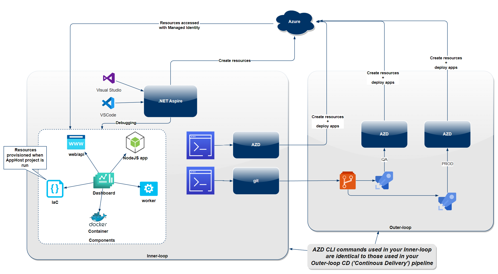

# From Code to Cloud: Embracing Modern DevSecOps Practices

This code repository has been created as a suppliment to the Professions lunch and learn session.

---

# Table of contents

- [Prerequisities](#prerequisities)
- [Focus](#focus)
- [Definitions](#definitions)
- [Inner Loop](#inner-loop)
  - [Why it matters](#why-it-matters)
  - [Benefits](#benefits)
  - [Project template](#project-template)
  - [Demos](#demos)
- [Outer Loop](#outer-loop)
    - [Demos](#demos-1)
        - [Deploy using the AZD CLI](#azd-azure-developer-cli)
        - [Deploy using a CD Pipeline](#cd-continuous-delivery)
- [SX](#sx-sustainability-transformation)

---

# Prerequisities:

To work with .NET Aspire, you need the following installed locally:

- .NET 8.0
- .NET Aspire workload:
  - Installed with the Visual Studio installer or the .NET CLI workload.
- AZD
- An OCI compliant container runtime, such as:
  - Docker Desktop or Podman.
- An Integrated Developer Environment (IDE) or code editor, such as:
  - Visual Studio 2022 version 17.10 or higher (Optional)
  - Visual Studio Code (Optional)
  - C# Dev Kit: Extension (Optional)

# Focus

_The primary focus of this repository is on_:
- Local development (your **inner-loop**)

> [!Note]
> However, it would not be fair if there were no guidance on how to take your cloud-native solution and deploy it to the Azure cloud platform.

**Not covered**:

- DAPR (Distributed Application Runtime)
- KEDA (Kubernetes Event-driven Autoscaling)
- Functions Apps - [This feature is planned](https://github.com/dotnet/aspire/issues/920#issuecomment-2159448671)
- Automated Testing
- Team Topologies

---

# Definitions

- Inner Loop

  Refers to the iterative process of writing, building and debugging code that a single developer performs before (a) sharing it with others or (b) deploying it.
  
- [.NET Aspire](https://learn.microsoft.com/en-us/dotnet/aspire/)

  .NET Aspire is an opinionated, cloud-ready stack for building observable, production-ready, distributed applications with .NET, delivered through a collection of NuGet packages that handle specific cloud-native concerns.

- [AZD](https://github.com/Azure/awesome-azd)
  
  The Azure Developer CLI (azd) is an open-source tool that accelerates the transition from local development environments to Azure by providing developer-friendly commands for key stages in the workflow, including code, build, deploy, and monitoring.
  
  - [Awesome AZD template site](https://azure.github.io/awesome-azd/)

---

# Tooling

_This highlights the utilization of both .NET Aspire and AZD during the development and deployment stages. Excluding automated testing, from a developers perspective, this is all the tooling you need to confidently develop, monitor, debug and deploy a modern distributed cloud-native solution._

> [!IMPORTANT]
> _Figure showing (a) .NET Aspire driving the development and debugging of applications, and the provisioning of Azure resources, and (b) the deploying of applications using the AZD CLI, irrespective of being in the Inner or Outer loop, ensuring a consistent tooling experience._



---

# Inner Loop

## Why it matters

- Maximizing inner-loop time boosts productivity and personal satisfaction for developers.
- Fix bugs before integrating your changes into mainline branch.
- Reducing outer-loop friction (through better tooling and automation) to minimize disruptions.

> [!NOTE]
> Talk about my journey:
> - Pace, clear the way, platforms, specialist
> - In pursuit of ways to improve developer productivity without diminishing quality
> - Have to learn more, not always intertesting, family, master of none

## Benefits

Here are some of the benefits of including .NET Aspire and AZD in your toolchain:


<details>

<summary>List of benefits</summary>

- Minimized context switching
- Fewer flow interruptions
- Enhanced release frequency
- Uniformed development environments
- Shorter feedback loops
- Rapid provisoning
- Eliminated need to run ELK stack and Docker Compose locally
- Eliminated need for Docker for Desktop or PodMon (_caveated_)
- Increased productivity and job satisfaction
- Frictionless promotion to CD when ready
- Resolved endpoint mapping, port issues, and connection string challenges
- Reduced reliance on platform specialization
- Observability and monitoring
- Simplier by less LoC, and with centralised configuration
- CDC ('Customer Driven Contracts') testig
- Solution Onboarding
- Bonus: Lowered carbon emissions (SX)

</details>


## Project template

> [!TIP]
> - NET Aspire orchestration assists with the following concerns: App composition, Service discovery and connection string management
> - It provides a set of abstractions that streamline the setup of service discovery, environment variables, and container configurations, eliminating the need to deal with low-level implementation details. 

_The responsibilities of the AppHost and ServiceDefaults projects:_

**AppHost:**

- The AppHost project orchestrates the launch of multiple service projects within the .NET Aspire app model.
- Specify the .NET projects, containers, executables, and cloud resources that make up the application.

**ServiceDefaults:**

- The ServiceDefaults project is a set of extension methods designed to streamline configuration management for cloud-native applications.
- It wires up telemetry, health checks, and service discovery.
- Key responsibilities include:
  - Configuring OpenTelemetry metrics and tracing.
  - Adding default health check endpoints.
  - Enabling service discovery functionality.
  - Configuring HttpClient to work with service discovery.


## Demos

> [!NOTE] 
> Drop into Dashboard of the 1st demo momentarily to show logging, distributed tracing and metrics.

_Show common cloud-native coding scenarios that would ordinarily force you outside of the four walls of development:_

- [.NET Aspire creates resource](Samples/Sample_Aspire_Creates_Resources/README.md) (local provisioning)
- [You create resource](Samples/Sample_Aspire_Creates_Resources_IaC/README.md) (custom bicep templates)
- [You use existing resource](Samples/Sample_Aspire_Using_Existing_Resources/README.md) (connection string and MSI)
- [Running a NodeJS app](Samples/Sample_Aspire_Run_NodeJs_App/README.md) (structured logs)
- [How to use containers](Samples/Sample_Aspire_Container_Redis/README.md) (redis output and distributed caching)
- [How to use a custom container](Samples/Sample_Aspire_Custom_Container/README.md)


# Outer Loop

_This section includes guidance & example(s) on how to seamlessly move from your inner-loop to your outer loop_.

## Demos

_In this section we'll look at how to deploy to Azure using (a) AZD CLI and (b) GitHub Workflow Actions._

### AZD ('Azure Developer CLI)


> [!TIP]
> - Can be used to deploy to a development cloud environment with no friction.

- [Click here for demo notes](docs/azd.md)

- 👆 All these commands will be used, along with `azd new env`, in the CD ('Continuous Delivery') pipeline.

### CD ('Continuous Delivery')

- [Config GH Workflow](docs/cd.md)

- Configuring ACA scaling rules

  _KEDA is not yet integrated_

  - Approaches:

    - Recommended by msft: 

      - Create infra manifest files and maintain these:

        ```powershell
        azd config set alpha.infraSynth on
        azd infra synth 
        ```

        ^ The manifests will only get overwritten when you run `azd infra synth` again.

      - "Eventually the right approach is to modify the apphost so that there's a single source of truth" - David Fowler

---

# SX ('Sustainability Transformation')

_Reduction in both **carbon emissions** and Cloud Platform costs_:

- Package up application code into an artifact, example:

    ```powershell
    azd package api --output-path ./dist/api.zip
    ```

- Then dpeloy the same artifact cross all environments, example:

    ```poewrshell
    azd deploy api --from-package <package-path>
    ```

- This saves on:
  - Duplicated Azure resources across environments (dev/uat/staging/production)
  - Carbon emissions
  - Pipeline build costs

- Branching strategies:
  - Release Flow (Advocated by Microsoft)
